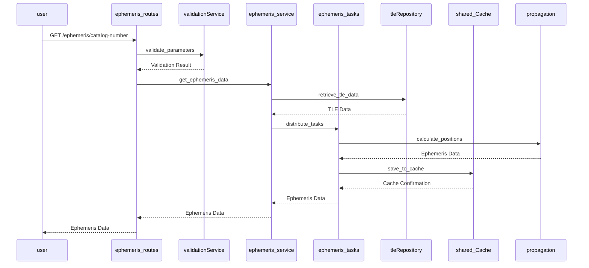
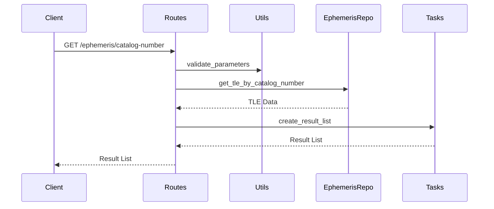
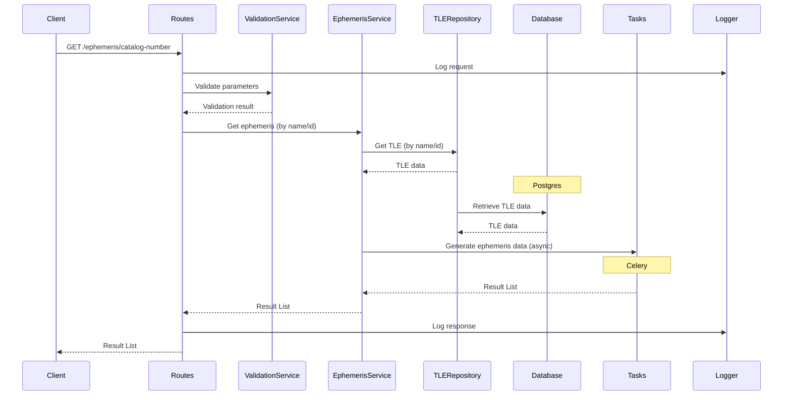

```mermaid
sequenceDiagram
    participant user
    participant ephemeris_routes
    participant validationService
    participant ephemeris_service
    participant ephemeris_tasks
    participant tleRepository
    participant shared_Cache
    participant propagation

user->>ephemeris_routes: GET /ephemeris/catalog-number
ephemeris_routes->>validationService: validate_parameters
validationService-->>ephemeris_routes: Validation Result
ephemeris_routes->>ephemeris_service: get_ephemeris_data
ephemeris_service->>tleRepository: retrieve_tle_data
tleRepository-->>ephemeris_service: TLE Data
ephemeris_service->>ephemeris_tasks: distribute_tasks
ephemeris_tasks->>propagation: calculate_positions
propagation-->>ephemeris_tasks: Ephemeris Data
ephemeris_tasks->>shared_Cache: save_to_cache
shared_Cache-->>ephemeris_tasks: Cache Confirmation
ephemeris_tasks-->>ephemeris_service: Ephemeris Data
ephemeris_service-->>ephemeris_routes: Ephemeris Data
ephemeris_routes-->>user: Ephemeris Data

```

```mermaid
sequenceDiagram
    participant Client
    participant Routes
    participant Utils
    participant EphemerisRepo
    participant Tasks

    Client->>Routes: GET /ephemeris/catalog-number
    Routes->>Utils: validate_parameters
    Routes->>EphemerisRepo: get_tle_by_catalog_number
    EphemerisRepo-->>Routes: TLE Data
    Routes->>Tasks: create_result_list
    Tasks-->>Routes: Result List
    Routes-->>Client: Result List
```

```mermaid
sequenceDiagram
    participant Client
    participant Routes
    participant ValidationService
    participant EphemerisService
    participant TLERepository
    participant Database
    participant Tasks
    participant Logger

    Client->>Routes: GET /ephemeris/catalog-number
    Routes->>Logger: Log request
    Routes->>ValidationService: Validate parameters
    ValidationService-->>Routes: Validation result
    Routes->>EphemerisService: Get ephemeris (by name/id)
    EphemerisService->>TLERepository: Get TLE (by name/id)
    TLERepository-->>EphemerisService: TLE data
    note over Database: Postgres
    TLERepository->>Database: Retrieve TLE data
    Database-->>TLERepository: TLE data
    EphemerisService->>Tasks: Generate ephemeris data (async)
    note over Tasks: Celery
    Tasks-->>EphemerisService: Result List
    EphemerisService-->>Routes: Result List
    Routes->>Logger: Log response
    Routes-->>Client: Result List
```
