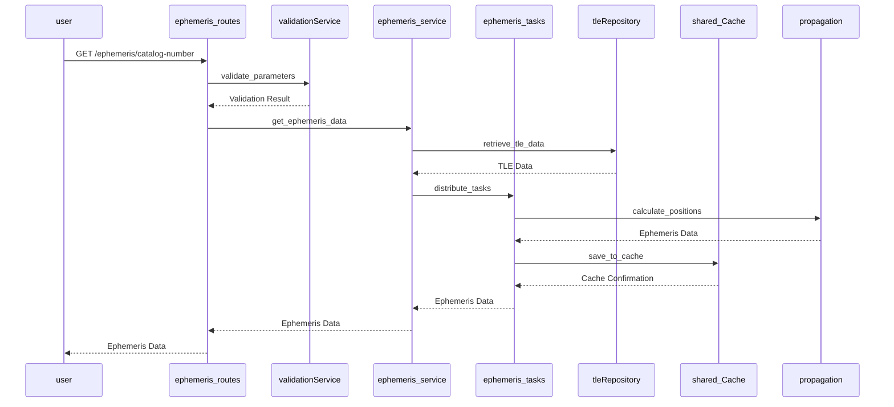

```mermaid
sequenceDiagram
    participant user
    participant ephemeris_routes
    participant validationService
    participant ephemeris_service
    participant ephemeris_tasks
    participant tleRepository
    participant shared_Cache
    participant propagation

user->>ephemeris_routes: GET /ephemeris/catalog-number
ephemeris_routes->>validationService: validate_parameters
validationService-->>ephemeris_routes: Validation Result
ephemeris_routes->>ephemeris_service: get_ephemeris_data
ephemeris_service->>tleRepository: retrieve_tle_data
tleRepository-->>ephemeris_service: TLE Data
ephemeris_service->>ephemeris_tasks: distribute_tasks
ephemeris_tasks->>propagation: calculate_positions
propagation-->>ephemeris_tasks: Ephemeris Data
ephemeris_tasks->>shared_Cache: save_to_cache
shared_Cache-->>ephemeris_tasks: Cache Confirmation
ephemeris_tasks-->>ephemeris_service: Ephemeris Data
ephemeris_service-->>ephemeris_routes: Ephemeris Data
ephemeris_routes-->>user: Ephemeris Data
```
