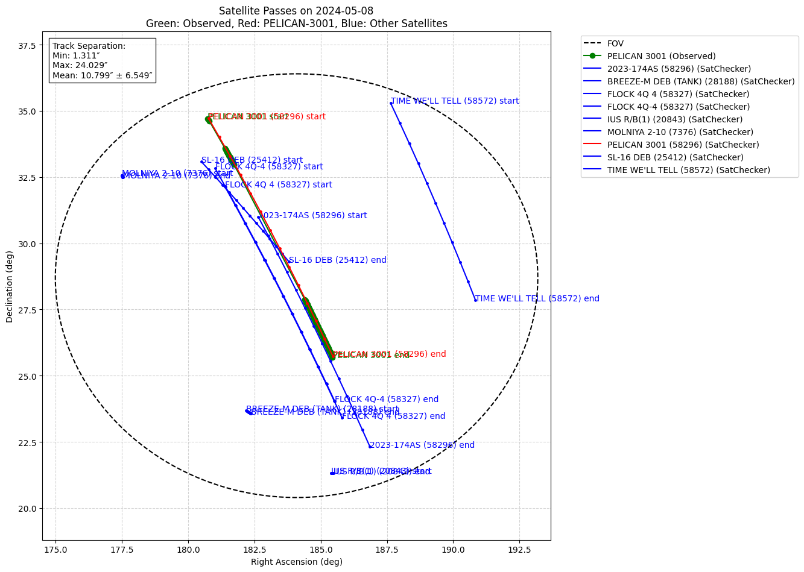
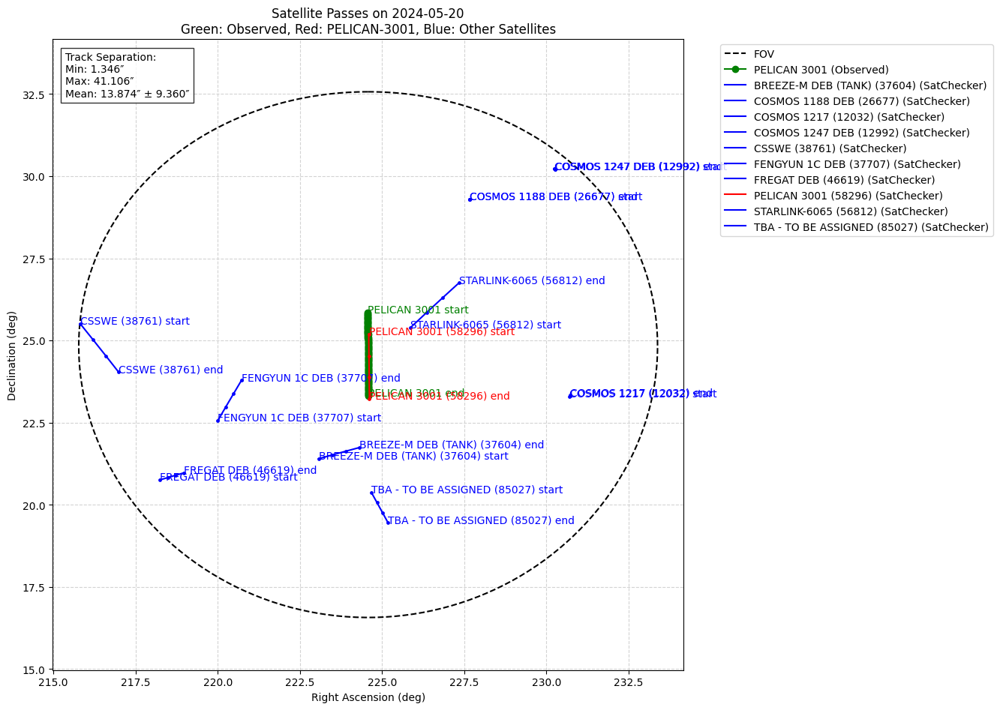
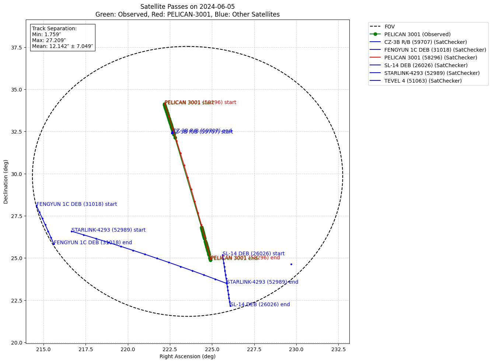
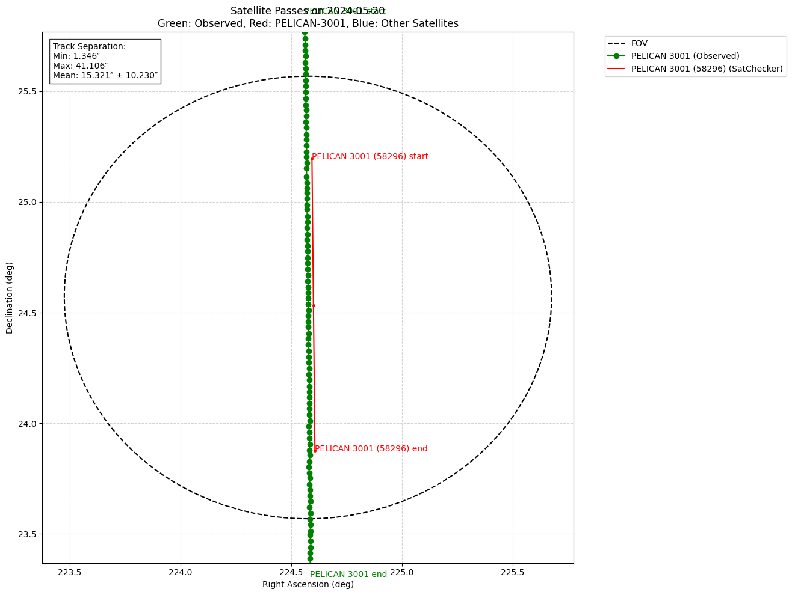
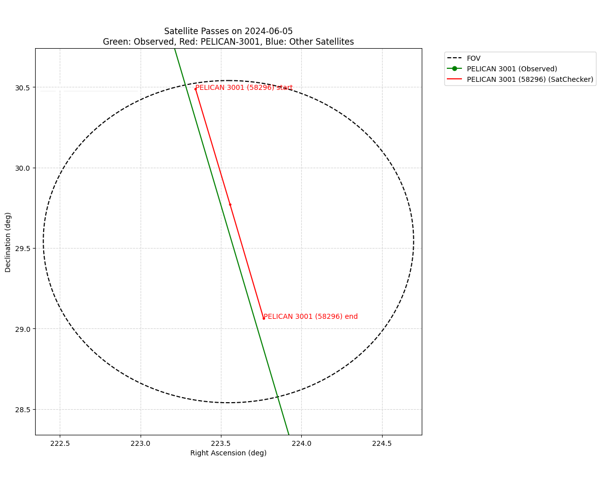
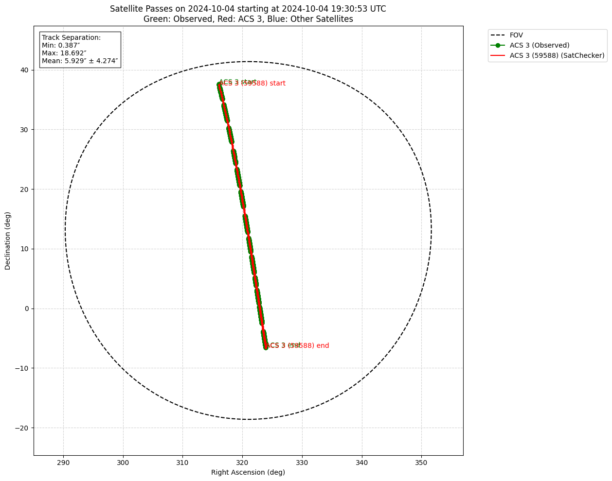

# FOV Verification

## Notes
This uses position data obtained from SCORE to verify/compare the position data obtained from the FOV API.
For Pelican 3001, other satellites found in the FOV query are also plotted, but not for ACS 3 since with the longer duration and field of view, there were too many satellites to plot.

The track separation is currently the difference is between points on the observed/predicted tracks. This means that the separation noted might be larger than the actual track separation if there are gaps in the data. Track separation should either calculate the distance between the tracks themselves or the FOV/data set should be split into smaller chunks to avoid gaps.

### Pelican 3001 - 8 degree FOV

----

### Pelican 3001 - 1 degree FOV

----

### ACS 3 - 30 degree FOV

