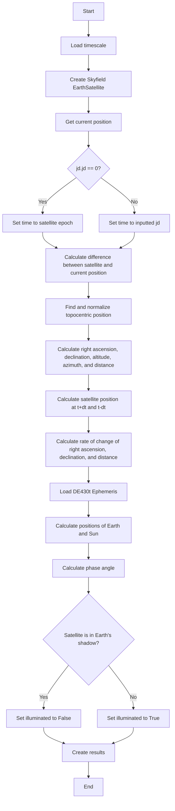

Satellite propagation is currently implemented using Skyfield and AstroPy libraries. This is sufficient for basic ephemeris calculations, but is far too slow for the number of ephemeris calculations needed to perform field of view checks. SatChecker will have its own implementation of satellite propagation using the SGP4 library, which Skyfield also uses. This is so that we can calculate only what is needed without any overhead or additional unnecessary calculations. Other libraries using SGP4 could also possibly be used to provide alternate methods of calculation.

### Skyfield Implementation

