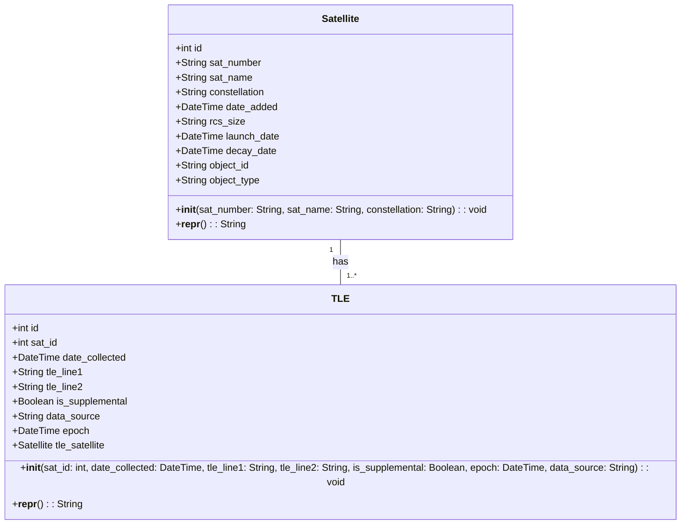

# Data Sources
TLEs are collected from Space-Track and Celestrak once daily, and supplemental TLEs for Starlink, OneWeb, Planet Labs, and Kuiper satellites are checked every 8 hours from Celestrak. Data is saved in a Postgres database; if the satellite associated with a given TLE isn’t in SatChecker’s database, it will be added and associated with TLEs for that object going forward.

# Satellite Names/IDs
Satellites often have temporary ids assigned by NORAD or Celestrak, or temporary names associated with their permanent ID such as “TBA - TO BE ASSIGNED” or “OBJECT A”. A few days after launch a satellite will be assigned its permanent name that will be associated with its NORAD id. Temporary NORAD desigations happen much less frequently than they used to, especially with data coming from SpaceTrack, but sometimes supplemental TLEs from Celestrak will use a temporary designation if the satellite was recently launched and not yet in SpaceTrack. The name/id check endpoints in the Tools API will show all identifiers associated with a satellite’s name or NORAD id, as well as the date the designation was added for reference.

# TLE Retention
Currently, all TLE data is persisted indefinitely, but as that dataset grows, the retention policy will be revisited. The current idea is to reduce data older than a 6 month period to 1 TLE per 2 week period, since TLEs lose their predictive accuracy after 2 weeks. The balance of accuracy of archival mode vs. dataset size will need to be considered; although it’s not as necessary for archival mode to have as high of positional accuracy, it’s important to not prematurely optimize the data set size.

# Classes

