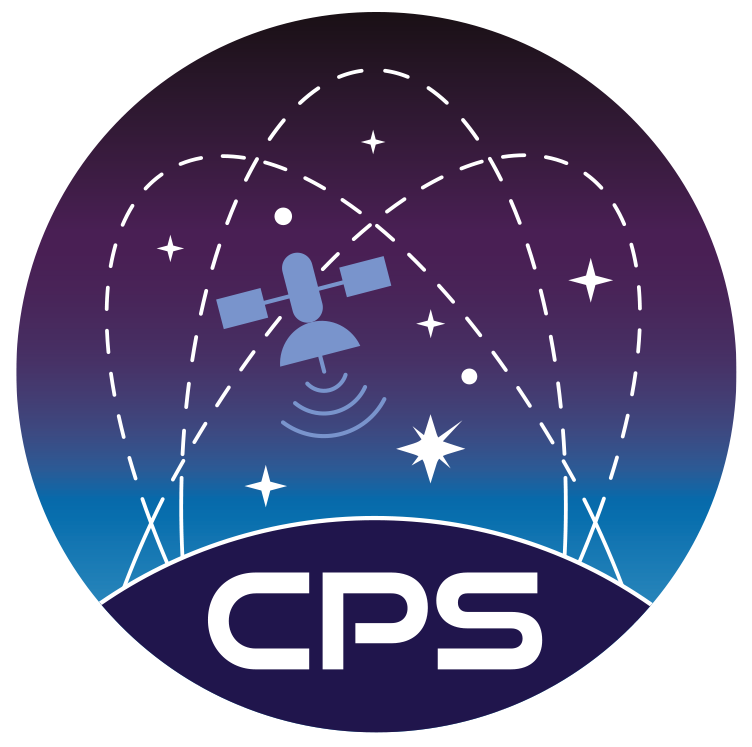
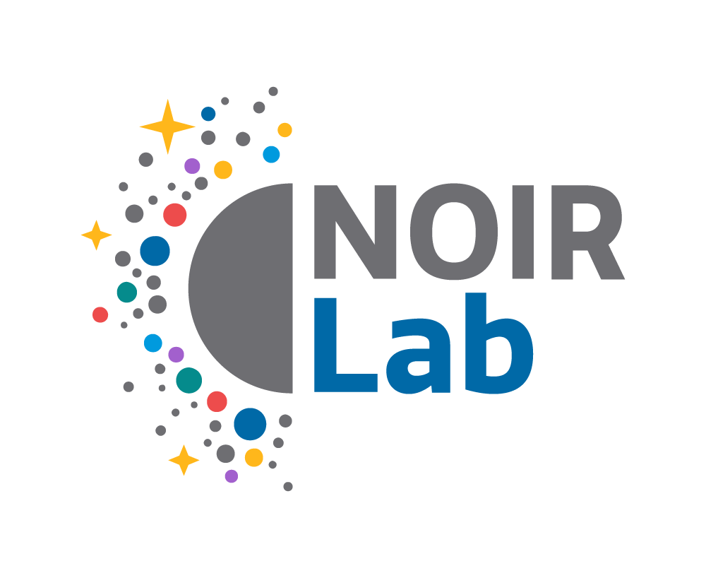
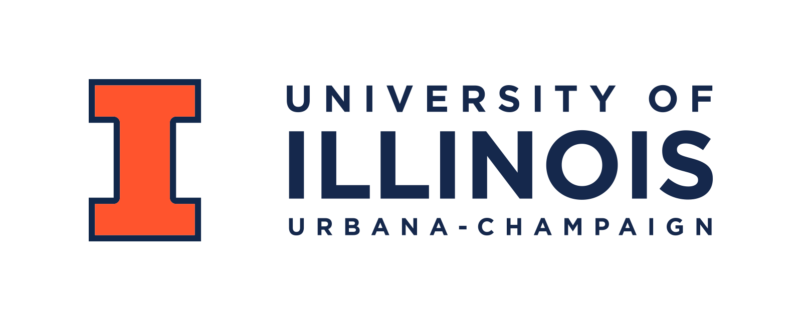

Acknowledgements
================

This effort is a collaboration between the IAU Centre for the Protection of the Dark and Quiet Sky
from Satellite Constellation Interference, NOIRLab, the University of Washington,
the University of Illinois Urbana-Champaign, and Imperial College London.

.. image:: _images/UW_logo.png
  :width: 200
  :alt: University of Washington Logo

SatChecker development was also supported in part by
Anthony Rihani and Nayan Jangid at the University of Illinois Urbana-Champaign.
