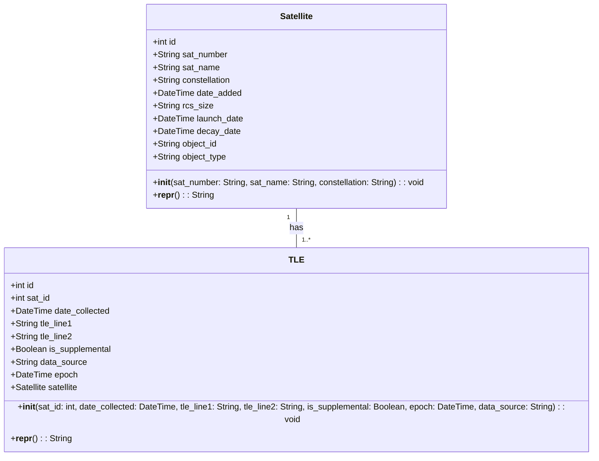

```mermaid
classDiagram
    class Satellite {
        +int id
        +String sat_number
        +String sat_name
        +String constellation
        +DateTime date_added
        +String rcs_size
        +DateTime launch_date
        +DateTime decay_date
        +String object_id
        +String object_type
        +__init__(sat_number: String, sat_name: String, constellation: String): void
        +__repr__(): String
    }
    class TLE {
        +int id
        +int sat_id
        +DateTime date_collected
        +String tle_line1
        +String tle_line2
        +Boolean is_supplemental
        +String data_source
        +DateTime epoch
        +Satellite satellite
        +__init__(sat_id: int, date_collected: DateTime, tle_line1: String, tle_line2: String, is_supplemental: Boolean, epoch: DateTime, data_source: String): void
        +__repr__(): String
    }
    Satellite "1" -- "1..*" TLE : has
```
