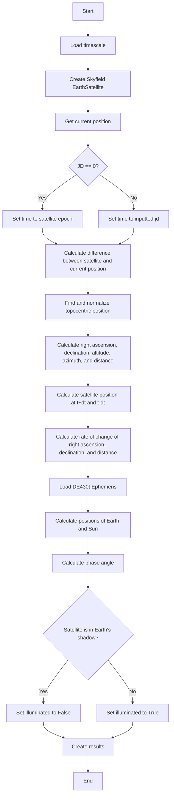

```mermaid
graph TD
    A[Start]
    B[Load timescale]
    C[Create Skyfield EarthSatellite]
    D[Get current position]
    E{JD == 0?}
    F[Set time to satellite epoch]
    G[Set time to inputted jd]
    H[Calculate difference between satellite and current position]
    I[Find and normalize topocentric position]
    K[Calculate right ascension, declination, altitude, azimuth, and distance]
    L[Calculate satellite position at t+dt and t-dt]
    M[Calculate rate of change of right ascension, declination, and distance]
    N[Load DE430t Ephemeris]
    O[Calculate positions of Earth and Sun]
    P[Calculate phase angle]
    Q{Satellite is in Earth's shadow?}
    R[Set illuminated to False]
    S[Set illuminated to True]
    T[Create results]
    U[End]
    A --> B
    B --> C
    C --> D
    D --> E
    E -- Yes --> F
    E -- No --> G
    F --> H
    G --> H
    H --> I
    I --> K
    K --> L
    L --> M
    M --> N
    N --> O
    O --> P
    P --> Q
    Q -- Yes --> R
    Q -- No --> S
    R --> T
    S --> T
    T --> U
```
